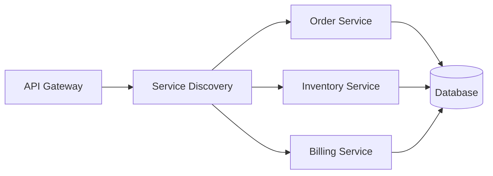
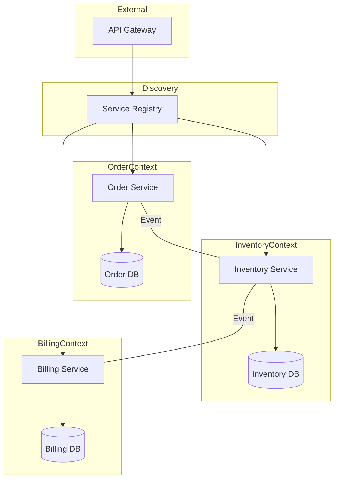

# Comprehensive Guide to Programming Paradigms, Microservices Patterns, DDD, and Architecture

This document provides an instructional overview of various programming paradigms, microservices design patterns, Domain-Driven Design (DDD) concepts, and microservice granularity. It concludes with a Mermaid diagram of a microservices architecture—presented in an initial form and then refined based on best practices.

---

## 1. Programming Paradigms

### 1.1 Functional Programming
Functional programming emphasizes pure functions, immutability, and higher-order functions.

- **JavaScript Example:**
  
  ```js
  // Functional Programming in JavaScript
  const numbers = [1, 2, 3, 4, 5];
  const squared = numbers.map(n => n * n);
  console.log(squared); // [1, 4, 9, 16, 25]
  ```

- **Java Example (using Streams):**

  ```java
  import java.util.Arrays;
  import java.util.List;
  import java.util.stream.Collectors;

  public class FunctionalExample {
      public static void main(String[] args) {
          List<Integer> numbers = Arrays.asList(1, 2, 3, 4, 5);
          List<Integer> squared = numbers.stream()
                                         .map(n -> n * n)
                                         .collect(Collectors.toList());
          System.out.println(squared);
      }
  }
  ```

---

### 1.2 Object-Oriented Programming (OOP)
OOP organizes software design around objects, encapsulation, inheritance, and polymorphism.

- **Java Example:**

  ```java
  // Object-Oriented Programming in Java
  public class Car {
      private String model;
      
      public Car(String model) {
          this.model = model;
      }
      
      public void drive() {
          System.out.println(model + " is driving.");
      }
      
      public static void main(String[] args) {
          Car car = new Car("Tesla Model S");
          car.drive();
      }
  }
  ```

- **JavaScript Example (ES6 Classes):**

  ```js
  // Object-Oriented Programming in JavaScript
  class Car {
      constructor(model) {
          this.model = model;
      }
      
      drive() {
          console.log(`${this.model} is driving.`);
      }
  }

  const car = new Car("Tesla Model S");
  car.drive();
  ```

---

### 1.3 Reactive Programming
Reactive programming deals with asynchronous data streams and propagates changes automatically.

- **JavaScript Example (using RxJS):**

  ```js
  // Reactive Programming in JavaScript using RxJS
  const { of } = rxjs;
  const { map } = rxjs.operators;

  of(1, 2, 3)
    .pipe(map(x => x * 2))
    .subscribe(x => console.log(x)); // Outputs: 2, 4, 6
  ```

- **Java Example (using Project Reactor):**

  ```java
  // Reactive Programming in Java using Reactor
  import reactor.core.publisher.Flux;

  public class ReactiveExample {
      public static void main(String[] args) {
          Flux.just(1, 2, 3)
              .map(x -> x * 2)
              .subscribe(System.out::println);
      }
  }
  ```

---

### 1.4 Serverless Computing
Serverless computing enables the execution of functions without managing underlying server infrastructure.

- **JavaScript Example (AWS Lambda):**

  ```js
  // Serverless function in Node.js for AWS Lambda
  exports.handler = async (event) => {
      const response = {
          statusCode: 200,
          body: JSON.stringify('Hello from Lambda!'),
      };
      return response;
  };
  ```

- **Python Example (AWS Lambda):**

  ```python
  # Serverless function in Python for AWS Lambda
  def lambda_handler(event, context):
      return {
          'statusCode': 200,
          'body': 'Hello from Lambda!'
      }
  ```

---

### 1.5 Aspect-Oriented Programming (AOP)
AOP helps separate cross-cutting concerns (like logging or security) from business logic.

- **Java Example (using Spring AOP):**

  ```java
  // Aspect-Oriented Programming in Java with Spring AOP
  import org.aspectj.lang.annotation.Aspect;
  import org.aspectj.lang.annotation.Before;
  import org.springframework.stereotype.Component;

  @Aspect
  @Component
  public class LoggingAspect {
      @Before("execution(* com.example.service.*.*(..))")
      public void logBeforeMethod() {
          System.out.println("A method in the service package is about to execute.");
      }
  }
  ```

---

### 1.6 Declarative Programming
Declarative programming expresses the logic of computation without describing its control flow.

- **SQL Example:**

  ```sql
  -- Declarative SQL query
  SELECT name, age FROM Users WHERE age > 18;
  ```

- **JavaScript Example (using Redux):**

  ```js
  // Declarative state management with Redux
  const initialState = { count: 0 };

  function counterReducer(state = initialState, action) {
      switch(action.type) {
          case 'INCREMENT':
              return { count: state.count + 1 };
          default:
              return state;
      }
  }
  ```

---

## 2. Microservices Design Patterns

For a startup planning to deploy around a thousand services, employing proven microservices design patterns is critical. Below is a list of 20 patterns along with brief descriptions.

1. **API Gateway:**  
   A centralized entry point that routes client requests to appropriate microservices.

2. **Service Discovery:**  
   Dynamically locates services within the network, enabling them to find each other.

3. **Circuit Breaker:**  
   Prevents cascading failures by halting calls to a service that is failing.

4. **Event Sourcing:**  
   Captures all changes to an application state as a sequence of events.

5. **CQRS (Command Query Responsibility Segregation):**  
   Separates read and write operations for performance and scalability.

6. **Saga Pattern:**  
   Coordinates distributed transactions by breaking them into a series of local transactions.

7. **Database per Service:**  
   Each service manages its own database, ensuring loose coupling.

8. **Sidecar Pattern:**  
   Deploys auxiliary tasks (like logging or monitoring) alongside the primary service container.

9. **Aggregator Pattern:**  
   Aggregates responses from multiple services into one unified response.

10. **Ambassador Pattern:**  
    Delegates network functions (e.g., retries, logging) to a side component.

11. **Backends for Frontends (BFF):**  
    Provides tailored backend services for different client interfaces.

12. **Strangler Pattern:**  
    Gradually replaces legacy system functionality with new microservices.

13. **Bulkhead Pattern:**  
    Isolates critical components to prevent system-wide resource exhaustion.

14. **Service Mesh Pattern:**  
    Manages service-to-service communication, including security and monitoring.

15. **Message Broker Pattern:**  
    Uses a message bus for asynchronous communication between services.

16. **Distributed Tracing:**  
    Tracks requests across services to diagnose performance issues.

17. **Config Server Pattern:**  
    Centralizes external configuration management for microservices.

18. **Canary Release Pattern:**  
    Rolls out changes to a small user subset to reduce deployment risks.

19. **Blue/Green Deployment:**  
    Maintains two identical production environments to reduce downtime during updates.

20. **Edge Service Pattern:**  
    Serves as a boundary layer to handle requests before routing them to backend services.

---

### Design Patterns Mapping Table

| Design Pattern                | Applicable Paradigm(s)                    | Suitable Language(s)                 |
|-------------------------------|-------------------------------------------|--------------------------------------|
| API Gateway                   | Declarative, Imperative                   | Java, JavaScript, Python, Go         |
| Service Discovery             | Declarative, Reactive                     | Java, Go, .NET, Python               |
| Circuit Breaker               | Reactive, Imperative                      | Java, JavaScript, .NET, Python       |
| Event Sourcing                | Functional, Reactive                      | Java, JavaScript, Python, Go         |
| CQRS                          | Declarative, Reactive                     | Java, C#, JavaScript, Python         |
| Saga Pattern                  | Imperative, Reactive                      | Java, Go, .NET, JavaScript           |
| Database per Service          | Declarative, Functional                   | Java, Python, Go, Node.js            |
| Sidecar Pattern               | Imperative, Declarative                   | Java, Go, Python, JavaScript         |
| Aggregator Pattern            | Declarative, Imperative                   | Java, Node.js, .NET, Python          |
| Ambassador Pattern            | Imperative, Declarative                   | Java, Go, JavaScript, Python         |
| Backends for Frontends (BFF)  | Declarative, Imperative                   | JavaScript, Java, Python, .NET        |
| Strangler Pattern             | Imperative                                | Java, Python, JavaScript, Go         |
| Bulkhead Pattern              | Reactive, Imperative                      | Java, .NET, Go, JavaScript           |
| Service Mesh Pattern          | Declarative, Reactive                     | Go, Java, .NET, Python               |
| Message Broker Pattern        | Reactive, Declarative                     | Java, JavaScript, Python, Go         |
| Distributed Tracing           | Imperative, Declarative                   | Java, Go, Python, .NET               |
| Config Server Pattern         | Declarative                               | Java, Node.js, Python, Go            |
| Canary Release Pattern        | Declarative, Imperative                   | Java, Python, JavaScript, Go         |
| Blue/Green Deployment         | Declarative, Imperative                   | Java, Python, Go, .NET               |
| Edge Service Pattern          | Declarative, Imperative                   | Java, Node.js, Python, Go            |

---

## 3. Domain-Driven Design (DDD)

### 3.1 Key Concepts
- **Bounded Contexts:**  
  Clear boundaries within which a specific domain model applies.

- **Ubiquitous Language:**  
  A common language shared by both developers and domain experts to reduce miscommunication.

- **Domain Models:**  
  Represent the core business logic and behavior.

- **Entities:**  
  Objects with a unique identity (e.g., Order, Customer).

- **Value Objects:**  
  Immutable objects representing descriptive aspects (e.g., Money, Address).

- **Aggregates:**  
  Groups of related objects treated as a single unit for data changes (e.g., Order with Order Line Items).

---

### 3.2 Use Case: E-Commerce Domain (Complex)
- **Bounded Contexts:**
  - **Ordering Context:**  
    Manages order creation, processing, and fulfillment.
  - **Inventory Context:**  
    Handles product stock levels and restocking.
  - **Billing Context:**  
    Processes payments and invoicing.
  
- **Entities & Value Objects:**
  - **Entities:**  
    - *Order* (with unique order ID)  
    - *Customer*  
    - *Product*
  - **Value Objects:**  
    - *Money* (to represent price)  
    - *Address* (for shipping)

- **Aggregates:**
  - *Order Aggregate* combining Order and Order Line Items.

- **Ubiquitous Language:**  
  Terms like "checkout," "cart," "payment," and "shipment" are standardized across teams.

---

### 3.3 Use Case: Blog Platform (Simpler System)
- **Bounded Context:**  
  A single context that manages posts and comments.

- **Entities & Value Objects:**
  - **Entities:**  
    - *Post*  
    - *Comment*
  - **Value Objects:**  
    - *Timestamp*  
    - *Content*

- **Aggregate:**
  - *Post Aggregate* comprising a Post and its associated Comments.

- **Ubiquitous Language:**  
  Terms such as "post," "comment," and "author" are consistently used.

---

## 4. Microservice Granularity

### 4.1 Containers vs. Pods
- **Containers:**  
  Lightweight, portable execution units (e.g., Docker containers) that encapsulate a microservice and its dependencies.

- **Pods:**  
  In Kubernetes, a pod is the smallest deployable unit, often containing one or more tightly coupled containers.

### 4.2 Practical Example

#### Dockerfile for a Microservice:
  
```dockerfile
# Dockerfile for a microservice
FROM openjdk:11-jre-slim
COPY target/microservice.jar /app/microservice.jar
ENTRYPOINT ["java", "-jar", "/app/microservice.jar"]
```

#### Kubernetes Pod YAML:
  
```yaml
apiVersion: v1
kind: Pod
metadata:
  name: microservice-pod
spec:
  containers:
    - name: microservice-container
      image: myregistry/microservice:latest
      ports:
        - containerPort: 8080
```

---

## 5. Microservices Architecture Mermaid Diagram

### 5.1 Original Mermaid Diagram



**Commentary:**
- The diagram illustrates an API Gateway routing requests to services discovered via a Service Discovery component.
- Order, Inventory, and Billing services connect to a single shared database (for illustration purposes).

---

### 5.2 Critique and Refinement

**Critique:**
- **Service Isolation:**  
  A single shared database contradicts the microservice principle of isolated persistence.
- **Service Communication:**  
  The diagram does not illustrate asynchronous communication or event-driven interactions.
- **Additional Components:**  
  Missing elements such as logging, monitoring, or a service mesh, which are common in robust architectures.

**Refined Mermaid Diagram:**



**Commentary:**
- **Bounded Contexts:**  
  Each microservice (Order, Inventory, Billing) is placed within its own bounded context with dedicated databases.
- **Service Discovery:**  
  A Service Registry is used for dynamic discovery.
- **Asynchronous Communication:**  
  The use of event-based interactions is depicted between services.
- **Enhanced Clarity:**  
  The refined diagram adheres to microservice best practices by isolating data stores and clarifying service interactions.

---

This comprehensive guide covers:
- **Programming Paradigms:** Including code examples in multiple languages.
- **Microservices Design Patterns:** A list of 20 patterns with a mapping table.
- **Domain-Driven Design (DDD):** Concepts and use cases from complex (e-commerce) to simple (blog platform) systems.
- **Microservice Granularity:** Explaining containers and pods with practical examples.
- **Microservices Architecture Diagram:** An initial Mermaid diagram, followed by a refined version based on best practices.

Feel free to use and adapt this guide as a reference for building scalable, maintainable microservices architectures.
